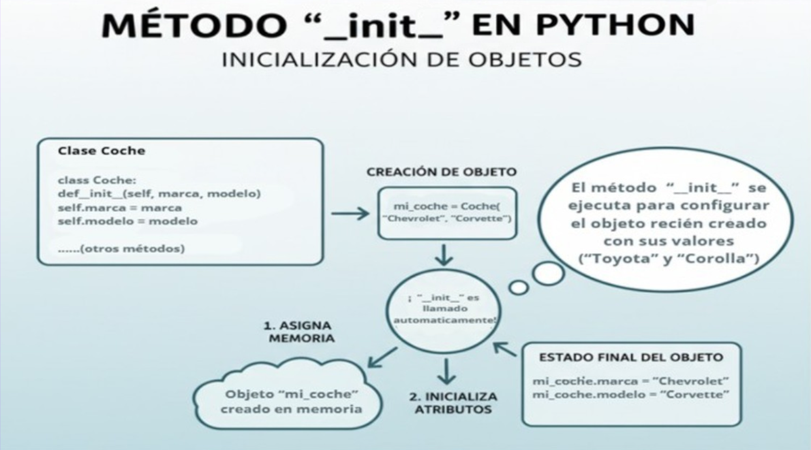
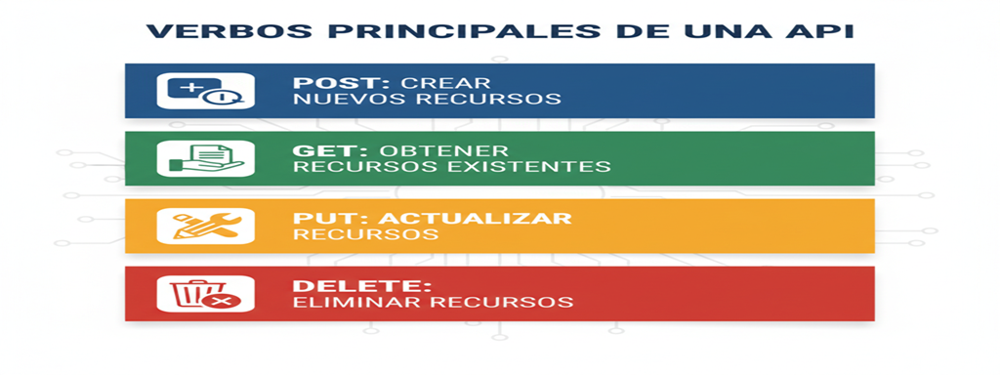
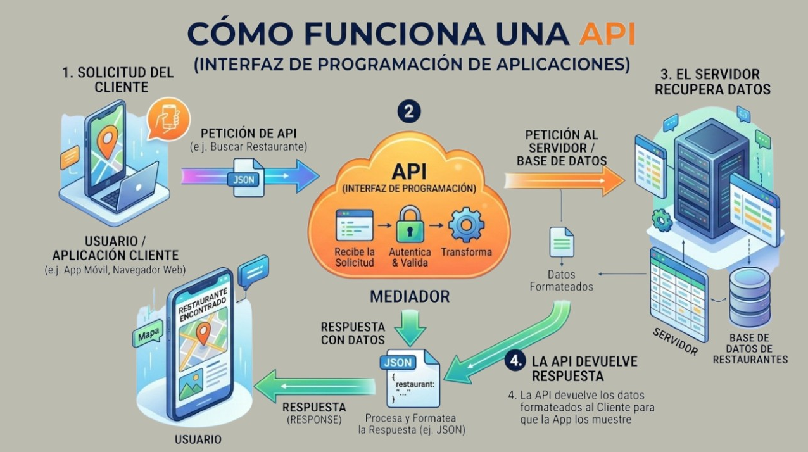
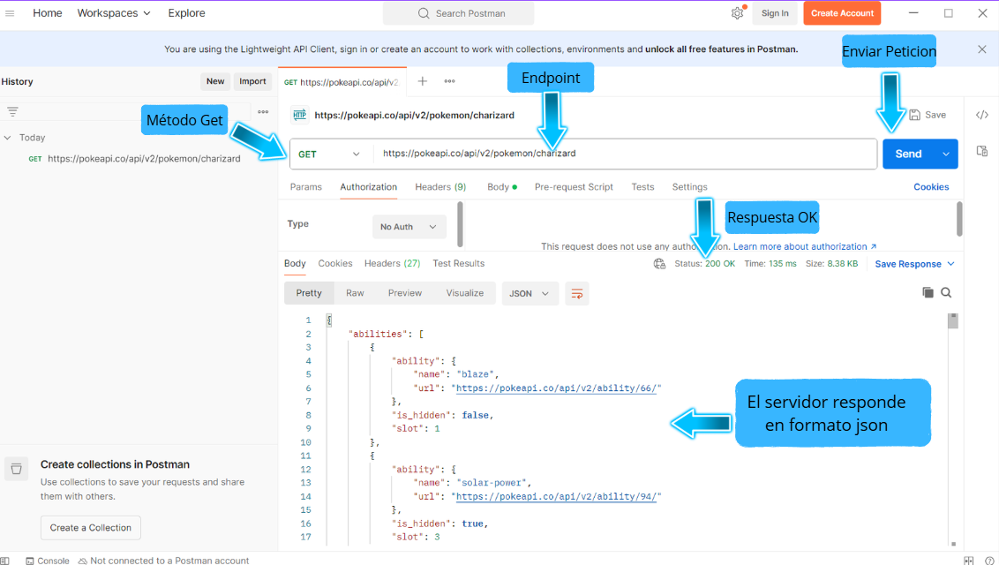
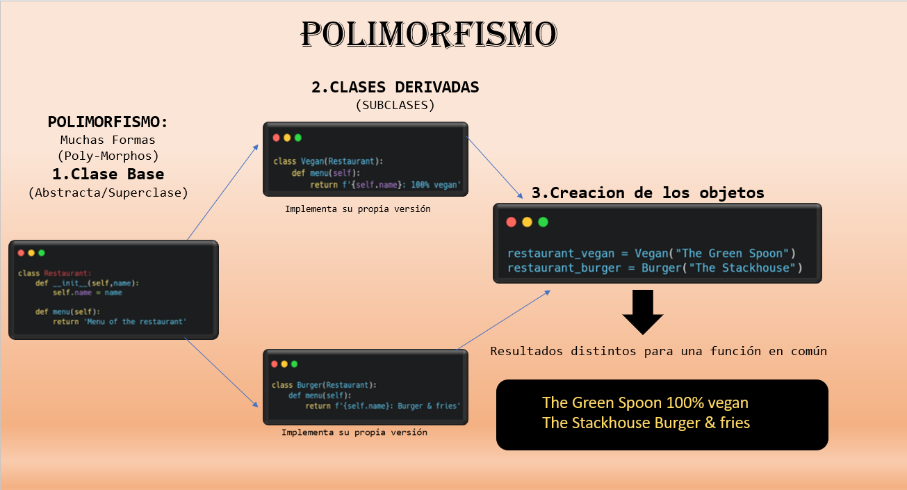
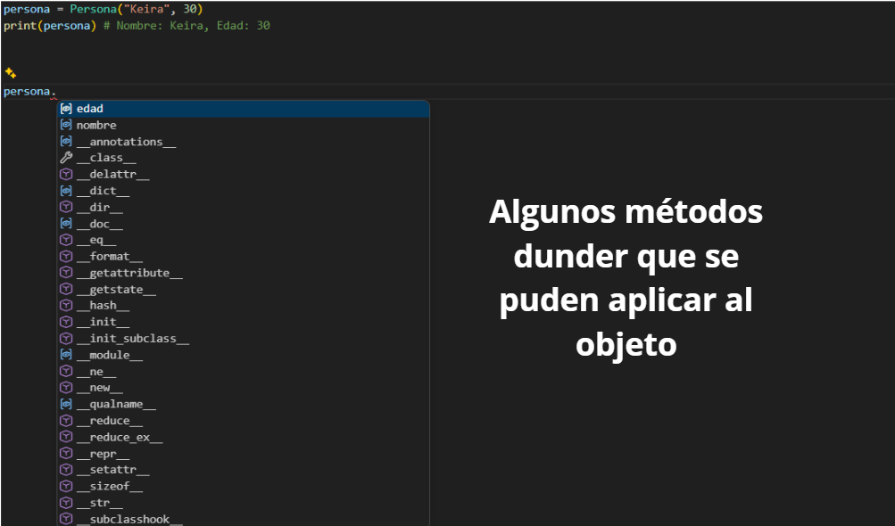
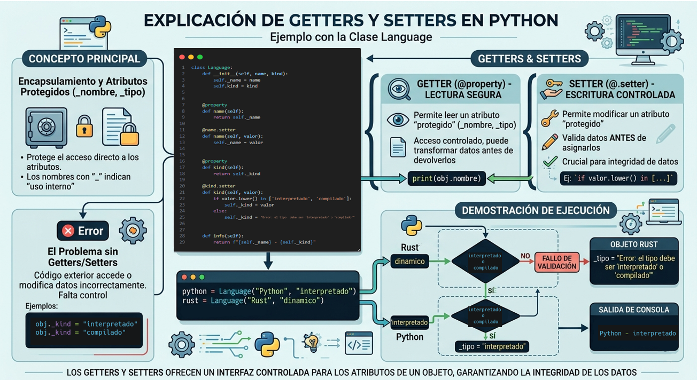

## 1. Clases en Python
Una clase es un tipo de dato cuyas variables se llaman objetos o instancias. La clase es la definicion del concep del mundo real y los objetos o intancias son el propio objeto del mundo real.  
Por ejemplo un coche, antes de ser fabricado tiene que ser definido, tiene que tener una plantilla que especifique sus componentes y lo que pued hacer, pues esa plantilla es lo que se conoce somo Clase. Y una vez construido ese coche seria el objeto o instancia de la clase coche.  
Las clases esta compuestas por dos elementos: 
- Atributos que son variables que pertenecen a una clase. Se utilizan para almacenar informacion y estalbecer el estado de un objeto. No hace falta definir las variables  antes de utilizarlas, la mayor parte de los atributos se definen en el constructor, sin embargo es posible definir otras variables dandoles un valor inicial.  
- Metodos que son las operaciones que realiza la clase. Se define como las funiones con la palabre reservada def y con su primer parametro se denomina self. Este parametro hace referencia al objeto desde donde se llama el metodo, de manera que para acceder a los atributos o metodos de una clase en su propia definicion se puede utilizar  la sintaxis `self.atributo `.

La clase coche podria tener atributos tales como  puertas, ruedas,  asientos, marchas, etc... y los metodos como acelerar, frenar, encender las luces, etc...
Las clases son estructuras que permiten definir un tipo de objeto agrupando datos (atributos) y comportamientos(funciones) que un objeto especifico tendrá. Son como plantillas o moldes para crear objetos. La convencion en python es usar para el nombre de la clase CamelCase.

Las clases se utilizan para organizar codigo  en estructruras logicas, representas entidades del mundo real, reutilizan codigo y aplican programacion orientada a objetos.

Ademas, permite organizar el codigo de forma modular y clara, facilitando la creacion de programas complejos mediante conceptos como la herencia y el encapsulamiento.

La herencia permite que una clase herede atributos y métodos de otra y el encapsulamiento consiste en ocultar los datos de un objeto asi se controla su acceso y protejen evitando que se modifique indebidamente.

Ejemplo de una clase
```python
class Coche:
    def __init__(self, color, marca, modelo, puertas):
        self.color = color
        self.marca = marca
        self.modelo = modelo
        self.puertas = puertas
        self.velocidad = 0
        self.luces_encendidas = False

    def acelerar(self, incremento_velocidad):
        self.velocidad += incremento_velocidad
        print(f"El coche {self.marca} {self.modelo} está acelerando. Velocidad actual: {self.velocidad} km/h")

    def frenar(self, decremento_velocidad):
        self.velocidad = max(0, self.velocidad - decremento_velocidad)
        print(f"El coche {self.marca} {self.modelo} está frenando. Velocidad actual: {self.velocidad} km/h")

    def encender_luces(self):
        self.luces_encendidas = True
        print(f"Las luces del coche {self.marca} {self.modelo} están encendidas.")

    def apagar_luces(self):
        self.luces_encendidas = False
        print(f"Las luces del coche {self.marca} {self.modelo} están apagadas.")

    def mostrar_info(self):
        print(f"\n--- Información del Coche ---")
        print(f"Marca: {self.marca}")
        print(f"Modelo: {self.modelo}")
        print(f"Color: {self.color}")
        print(f"Puertas: {self.puertas}")
        print(f"Velocidad actual: {self.velocidad} km/h")
        print(f"Luces encendidas: {'Sí' if self.luces_encendidas else 'No'}")

# Ejemplo de uso de la clase Coche:
mi_coche = Coche("Rojo", "Chevrolet", "Corvette", 4)
mi_coche.mostrar_info()

mi_coche.acelerar(50)
mi_coche.encender_luces()
mi_coche.frenar(20)
mi_coche.apagar_luces()
mi_coche.mostrar_info()

```

Porque usar las clases:
- Reutilizacion de codigo: El codigo utilizado para crea la clase se puede aplicar a varios objetivos, de esta manera se evita la duplicacion del codigo.
- Modularidad y organizacion: Se facilita el trabajo en equipo al dividir programas complejos en objetos manejables.
- Abstraccion y Encapsulacion: Permite oculta la complejidad interna de un objeto y protejer sus datos o solo exponer lo necesario.
- Mantenimiento: Al estar el codigo organizaso es mas facil detectar errores y actualizar las funciones especificas sin afectar todo el sistema.
- Flexibilidad: Permite crear jerarquias de clases y metodos que se adapten a diferentes contextos.
- Escalabilidad: Permite añadir nuevas funcionalidades sin tener que reescribir todo el codigo lo que facilita el crecimiento de la aplicacion.


## 2. Método que se ejecuta automáticamente cuando se crea una instancia de una clase

El metodo que se ejecuta automaticamente cuando se crea una instancia de una clase es llama constructor.
Un constructor es un metodo especial de la clase que se ejecuta automaticamente en el momento en que se crea(intancia) un objeto, permitiendo inicializar sus atributos. Si no añades el constructor el programa no se rompe, pero no se inicializaran los atributos y obtendras un objeto vacio.

Se define con el metodo `__init__`, el doble guion bajo significa que este reservado para un uso especial del lenguaje, en este caso sería para el constructor.


```python
class Person:
    def __init__(self, name, last_name):
        self.name = name
        self.last_name = last_name

    def sayHello(self):
        print(f' Hello my name is {self.name}{self.last_name}')

# Creamos una instancia
jhon = Person("Jhon"," Doe")


#Probamos el resultado
jhon.sayHello()
```
<p align="center"> </p>  

## 3. Los tres verbos de API
En esta pregunta creo que se refiere al CRUD y yo tengo 4.   
Lo verbos de una API(llamados tecnicamente Métodos HTTP) que son las acciones que indican al servidor lo que queremos hacer con un recurso especifico. Las cuatro principales son crear, leer, actualizar y borrar que en ingles  forman un acronimo de CRUD (**C**reate, **R**ead, **U**pdate, **D**elete).

1. POST (Crear)  
   Se usa para enviar nuevos datos al servidor para que cree un nuevo registro.
2. GET (Leer)  
   Se  usa para pedir informacion al servidor. Solo es para consulta.
3. PUT (Actulizar)  
   Se usa para modificar algo que ya existe, se reemplaza por los nuevos datos.
4. DELETE (Borrar)  
   Se usa para borrar un registro. 

   <p align="center"> </p>  


## 4. MongoDB

MongoDb es un sistema de bases de datos NoSQL. A diferencia de las bases de datos tradicionales SQL no utilizan tablas con filas y columnas, sino que almacena la informacion en documentos con una estructura de datos BSON (similar a JSON) con  un esquema dinamico.  

Caracteristicas:

- Velocidad que alcanza un balance perfecto entre rendimiento y funcionalidad gracias a su sistema de consulta de contenidos.
- Consultas ad hoc: se pueden realizar todo tipo de consultas, podemos buscar campos, expresiones regulares, consultar rangos. Ademas de estas consultas pueden devolver un campo especifico  del documento, pero tambien ser una funcion JavaScript definida por el usuario.
- Indexacion. El concepto de indices es similar al de las bases relacionales, con la diferencia de que cualquier campo documentado puede ser indexado y añadir multiples indices secundarios.
- Replicacion: el sistema soporta un modelo de replicacion de tipo primario-secundario.
   Sus funciones principales son:
      - Gestion de consultas: Mientras el nodo primario se encarga de las operaciones, los nodos secundarios actuan como copias de seguridad de solo lectura.
      - Alta disponibilidad: si el nodo primario deja de responder, los nodos secundarios tienen la capacidad de realizar una votacion y elegir de forma automatica un nuevo nodo primario y asi garantizar que el sistema siga operativo.
- Balanceo de Carga: El sistema puede distribuir la carga de traba entres los servidores, lo que permite escalar el rendimiento segun las necesidades de la aplicacion.
- Almacenamiento de archivos: Esta funcionalidad llamada `GridFS`  esta incluida en la distribucion oficial  y permite manipular archivos y contenido.
- Ejecucion de JavaScript del lado del servidor. Se pueden realizar consultas directamente a la base de datos para ser ejecutadas mediante JavaScript.

Ventajas:
- Flexibilidad y esquema dinámico.
- Alto rendimiento y  velocidad
- Escalabilidad y alta disponibilidad.
- Multiplataforma y facil instalacion. 
- Adaptabilidad.

Desventajas:
- Menor Eficiencia en consultas complejas.
- Mayor consumo de memoria.
- Dificultad de realizar joins en consultas


MongoDB es una base ideal para ciertos tipos de aplicaciones como:
1. - Gestion de contenido y redes sociales
2. - Sistemas de gestion de contenido (CMS)
3. - Aplicaciones de gran escala y trafico
4. - Procesamiento de datos en tiempo real y Big Data
5. - Aplicaciones geoespaciales
6. - Aplicaciones de comercio electrónico


Se utiliza cuando los datos cambian rapidamente y no tiene estructura fija, tambien cuando se necesita escalar rapidamente. Es emplea para aplicaciones web , APIs y  sistemas en tiempo real.  

Una colección en MongoDB es un conjunto de documentos relacionados que se almacenan dentro de una base de datos.  
Estructura:

- Colección:  agrupa datos (equivale a una tabla en SQL)  
- Documentos:  cada elemento dentro de la colección  
- Campos: los datos de cada documento  


| SQL (tradicional) | MongoDB          |
| ----------------- | ---------------- |
| Tablas            | Colecciones      |
| Filas             | Documentos       |
| Columnas          | Campos           |

Este es un ejemplo de un documento, puede tener distintos tipos de datos.
```javascript
{
    _id: ObjectId('69c571b4a6cd3228e511403c'),
    name: 'Dart',
    year: 2011,
    creator: 'Google',
    type: 'compilado',
    paradigm: 'multiparadigma',
    popular_use: 'apps multiplataforma',
    extension: '.dart',
    frameworks: [ 'Flutter' ],
    libraries: [ 'http', 'provider' ],
  
  }
```


## 5. API
Una API (Application Progamming interfaz) es un conjunto de reglas que permite que dos aplicaciones se comunique entre si para inercambiar datos, caracteristicas  y funcionalidades. Si ellas los programas no podrian compartir datos.   
Actua de como un intermediario que permite que un programa solicite informacion  a otro programa sin necsidad de conoces como esta construido internamente. 

### ¿Como funciona una API?
La arquitectura de comunicaion de una Api se basa normalmente  en una relacion ede cliente y servidor.

El cliente es la aplicacion que envia la solicitud.
El Servidor es el sistema que recibe la solicitud y proporciona la respuesta.
El intercambio de datos es la API que permite compartir solo los paquetes necesarios para la solicitud especifica manteniendo ocultos el resto de los detallas internos del sistema, lo que favorece la seguridad.

### Tipos de API según su arquitectura
 - **API REST**   
 Funcionan mediante el intercambio de datos donde el cliente envia solicitudes al servidor (usando los verbos HTTP como GET, PUT, POST) y este devuelve una respuesta. Su principal caracteristica es que no tienen estado, lo qu significa que el servidor no guarda datos entre del cliente entre solicitudes.

 - **API de WebSocket**   
 Es un desarrollo moderno que utiliza objetos JSON para transmitir datos. A diferencia de otras admite cominicación bidireccional, permitiendo que el servidor envie mensajes de forma activa a los clientes conectados lo que hace mas  eficiente que REST en algunos casos.

 - **API de SOAP**   
 Utilizan un protocolo simple de acceso a objetos y el intercambio de mensajes se realiza mediante XML. Es un tipo de API menos flexible en el pasado fue muy popular.

 - **API de RPC**  
 Estas APIs se denominan llamadas a procedimientos remotos. El cliente completa una función en el servidor, este le devuelve el resultado.

 - **GraphQL**  
 Aunque es un lenguaje de consulta, se utiliza como una alternativa a REST que permita a los clientes solicitar esactamente los datos que necesitan y nada más, pudiendo consultar varias fuentes de datos con un solo punto  de conexion

 ### Tipos de API según su ámbito de uso

 - **APIs privadas**  
 Son de uno interno dentro de una empresa para conectar suspropios sistemas y datos.

 - **APIs publicas**  
 Están abiertas al publico generaly cualquier persona puede utilizarlas, aunque pueden requerir autorización o tener un coste asociado.

 - **APIs de socios**   
 Solo pueden ser utlizadas por desarrolladores externos que tengan una utorización específica para colaborar en asociaciones  entre empresas.
 
 - **APIs compuestas**  
 Son aquellas que combinan dos o más APIs distentas pra sitisfacer requisitos o comportamientos complejos del sitema.

 ### Tipos de APIs según su nivel o tipo de acceso

 - **API de datos**  
 Proporcionan acceso( generalmente CRUD) a conjudos de datos subyacentes o sistemas de gestion de bases de datos
- **API del sistema operativo (Locales)** 
Definen como  utilizan las apps los servicios y recursos del sistema operativo en el que se ejecuta.
- **APIs Remotas**  
Diseñadas para que un software acceda a resusos ubicado fuera del dispositivo que realiza la solicitur conectándose a travçes de una red.
- **API Web**  
Son las mas comunes transfieren datos y  funcionalidades ente sistemas basado en la web o arquitectura cliente-servidor a traves de internet usando HTTP.


### Las ventajas de usar una API:  
- **Integracion y Reutilizacion**   
Están diseñadas para integrar diferentes aplicaciones, permitiendo que ls funciones y procedimientos de un sistema sear reutilizacos por otros softwares.

- **Eficiencia y Automatizacion**  
Permite automatizar procedimientos e inercambisr datos de manera que el contienido se publique de forma automatica y es disponible en diverso canales simultaneamente.
- **Flexibilidad y adaptabilidad**  
Garantizan una mayor flexibilidad en la transparencia de informacion ya que poseen un alta capacidad de adaptarse a los cambios mediante lla migración de datos y la flexiblidade de los servicios.
- **Alcance**  
A traves de las APIs, es posiblr crear capas de aplicaciones  con el fin de distribuir informacion a diferentes audiencias.
- **Personalizacion**  
Funcionan como una solucion para crear experiencias diferenciadas para el usuario, permitiendo adaptar protocolo, funciones y comando segun necesidades especificas.

### Importacias de las APIs
Las APIs son cruciales en el mundo de la tecnologia por las siguientes razones:
- Permiten  que diferentes aplicaciones y sistemas funcionen juntos de manera armoniosa. Esto significa que puedes combinar servicios y funcionalidades de multiples fuentes para crear experiencias mas ricas para los usuarios.
- Agilizan el desarrollo del software ya que los desarrolladores puedes aprovechar  el trabajo previo realizado por otros. En lugar de crear  funcionalidades desde cero, pueden utlizar APIs existentes para acelerar el desarrollo de software.
- Cuando una empresa actualiza o expande sus servicios, puede hacerlo sin afectar negativamente a las aplicaciones que utilizan su API. Esto garantiza una transicion suave y eva interrupcioes para los usuarios.
- Impulsan la  innovacion, ya que otras empresas o desarrolladores pueden crear nuevas soluciones basadas en APIs existentes.
- Facilitan la integración con terceros, lo que permite añadir servicios externos como pagos, mapas, autenticación o envío de correos sin desarrollarlos desde cero.
- Mejoran la seguridad, ya que permiten controlar el acceso a los datos mediante la autenticacion, permisos y limitaciones de uso. 

### Principales retos de las APIs

- *Obsolescencia* : si una API deja de actualizarse o desaparece, las aplicaciones dependientes pueden quedar inservibles o enfretar graves problemas de compatibilidad. Esto obliga a los desarrolladores  a estar en constante vigilancia  para migrar a versiones mas recientes.
- *Documentación insuficiente*: una API que no este bien explicada puede generar frustración y errores durante el proceso de  integración.
- *Gestión del versionado*: actualizar una API para introducir mejoras sin romper la compatibilidad con quienes la usan es un desafío constante.
- *Dependencia de terceros*: cuando una aplicacion utiliza  la API de otra empresa, se corre el riesgo de interrupciones si su servicio falla.
- *Seguridad*: al exponer funciones y datos a terceros, se convierten en un objetivo para ciberataques. Los riesgos incluyen accesos no autorizados a informacions sensible, filtracion de datos y ataque de denagación de servico que bloquean  su disponibilidad.

### ¿Como funciona una API?
La arquitectura de comunicaion de una Api se basa normalmente  en una relacion ede cliente y servidor.

El cliente es la aplicacion que envia la solicitud.
El Servidor es el sistema que recibe la solicitud y proporciona la respuesta.
El intercambio de datos es la API que permite compartir solo los paquetes necesarios para la solicitud especifica manteniendo ocultos el resto de los detallas internos del sistema, lo que favorece la seguridad.

Vamos a explicarlo con una analogia sobre el tiempo paso a paso:
Tenemos una app del tiempo y queremos saber que tiempo va a hacer el fin de semana.
1. Tu *"usuario"* abres la app y pones la ciudad.
2. La App *"Cliente"* es lo que vemos los botones, el cuadro de texto donde introducimos la ciudad, las imagenes, etc... solo diseño, no sabe que tiempo hace.
3. El Servidor Meteorologico *"Servidor"*  es donde se almacenan y se guardan los datos del tiempo.
4. La API *"mensajero"* es el puente que conecta la app con el servidor meterologico, enviado la peticion y devolviendo la respuesta.



## 6.Postman

Es una herramienta que permite probar, crear y trabajar con APIs de forma sencilla, sin tener necesidad de programar una aplicacion completa. Se utiliza principalmente para enviar petiiones HTTP como GET, PUT, POST y DELETE a un servidor y ver las respuestas que devuelve.

Un ejemplo practico imagina que queremos hacer una app de Pokemon.

Queremos que la app muestre los datos del pokemon, ej: habilidades, nombre, tipo, etc..., antes de que programar nada en tu proyecto puedes probar si la api funciona y para ello se hace una prueba con postman a ver si te devuelve los datos.
Si en el postman le haces una peticion GET https://pokeapi.co/api/v2/pokemon/charizard postman de devuelve por un lado un 200 OK significa que funciona que te ha devuelto los datos y por otro te devuelve un Json con los datos.

En este caso solo puedes hacer GET, pero se podria crear nuestra propia API y enviar las peticiones que fuesen necesarias.



## 7. Polimorfismo

El poliforfismo es un principio de programacion orientada a objetos que permiten que diferentes clases respondan al mismo metodo pero de manera distinta.  
Se basa en la idea de un mismo mensaje (llamada a un metodo )puede producir diferentes resultados dependiendo del objeto que lo recibe.
En resumen la palabra viene de (poli=muchos, morfismo=formas) lo que significa: una misma accion que toma muchas formas.
Para que funcione las diferentes clases han de compartir un metodo identico, por ello suele ir acompañado de la herencia de clases

Ejemplo:
```Python
class Restaurant:
    def __init__(self,name):
        self.name = name
    
    def menu(self):
        return 'Menu of the restaurant'

class Vegan(Restaurant):
    def menu(self):
        return f'{self.name}: 100% vegan and healthy menu'

class Burger(Restaurant):
    def menu(self):
        return f'{self.name}: Menu with hamburgers and french fries'


restaurant_vegan = Vegan("The Green Spoon")
restaurant_burger = Burger("The Stackhouse")

# Llamamos al mismo método, pero cada clase responde diferente
print(restaurant_vegan.menu()) # The Green Spoon: 100% vegan and healthy menu
print(restaurant_burger.menu())  # The Stackhouse: Menu with hamburgers and french fries

```

En este ejemplo tenemos una clase Padre llamada Restaurant y dos clases hijas (Vegan y Burger) todas tienen el mismo metodo `menu()` pero cada una responde distinto segun su implementacion.




## 8.Método dunder

Son metodos que comienzan y acaban con dos guiones bajos, por ejemplo `__init__`, `__str__`.  
La palabra `dunder` viene de **d**ouble **under**score. Se utilizan para definir comportamientos especiales de objetos y permiten que las clases interactúen con operadores o funciones integradas en python.
Los metodos dunder permiten que los objetos se comportes como tipos nativos de python, por ejemplo:
```python

a+b # Llama a a.___add__(b)
len(objeto)   # llama a objeto.__len__()
print(objeto) # llama a objeto.__str__()

```

Python tiene la filosofía de “todo es objeto”. Para que todas las operaciones estándar funcionen con cualquier tipo de objeto, necesitaba un mecanismo uniforme para que los objetos respondieran a operadores y funciones integradas.

Ejemplo:

- Cuando haces print(obj), Python internamente necesita una forma consistente de convertir cualquier objeto en texto.  
- Para eso, llama al método especial` __str__ `del objeto.  
- Si no existiera `__str__`, Python no tendría forma de saber cómo representar tu objeto como cadena.  

Métodos dunder más utilizados:

Inicialización y Gestión de Objetos
__init__(self, ...): Inicializador de la clase (constructor).
__new__(cls, ...): Creador de instancias.
__del__(self): Destructor de objetos.

Representación de Cadenas
__str__(self): Representación amigable para el usuario (print(), str()).
__repr__(self): Representación formal para desarrolladores.

Operaciones Aritméticas (Sobrecarga de Operadores) __add__(self, other): Suma (+).
__sub__(self, other): Resta (-).
__mul__(self, other): Multiplicación (*).
__truediv__(self, other): División (/).

Comparaciones __eq__(self, other): Igualdad (==).
__lt__(self, other): Menor que (<).
__le__(self, other): Menor o igual (<=).
__gt__(self, other): Mayor que (>).
__ne__(self, other): Distinto (!=).

Contenedores y Colecciones __len__(self): Longitud del objeto (len()).
__getitem__(self, key): Obtener elemento (obj[key]).
__setitem__(self, key, value): Asignar elemento (obj[key] = value).
__delitem__(self, key): Eliminar elemento (del obj[key]).
__contains__(self, item): Verificación de pertenencia (in).

Iteración
__iter__(self): Devuelve un iterador.
__next__(self): Devuelve el siguiente elemento de la iteración.

Comportamiento de Funciones y Contexto __call__(self, ...): Permite llamar al objeto como una función (obj()).
__enter__(self) / __exit__(self): Usados en contextos de gestión de recursos (with).

Los métodos dunder son la interfaz estándar que Python usa para operar con todos los objetos, sin importar si son objetos propios o creados por el usuario.
Ejemplo:

```python
class Persona:
    def __init__(self, nombre, edad):
        self.nombre = nombre
        self.edad = edad


p = Persona("Keira", 30)
print(p) # <__main__.Persona object at 0x000001B458C98C20>

```
Lo que sucede aqui es que te esta mostrando que es un objeto y en que posicion de memoria esta guardado. Para que te muestre el nombre y la edad habe que usar un metodo dunder como por ejemplo `__str__`
```python
class Persona:
    def __init__(self, nombre, edad):
        self.nombre = nombre
        self.edad = edad

    def __str__(self):
        return f"Nombre: {self.nombre}, Edad: {self.edad}"


persona = Persona("Keira", 30)
print(persona) # Nombre: Keira, Edad: 30

```
Aqui si  imprime el nombre y edad



## 9.Decorador 

Los decoradores son una herramienta que permite modificar el comportamiento de una funcion sin cambiar su codigo original es como envolver una funcion dentro de otra.  
Una Analogia:  
Una llave es una funcion que abre una puerta, si añadimos un decorador en este caso un llavero con nombre, no cambia la forma de la llave, pero sabes que puerta abre.   
La sintaxis es la `@` seguido del nombre del decorador.     
`@mi_decorador`  
El python los decoradores `@property`y `@<propiedad>setter`  se usan para controlar como se acceden y modifican los atributos de una clase. De esta manera se encapsulan los datos protegiendolo, tambien se valida la informacion antes de modificarla.  

Ejemplo
```python
class Language:
    def __init__(self, name, kind):
        self._name = name         
        self.kind = kind      


    @property
    def name(self):
        return self._name

    @name.setter
    def name(self, valor):
        self._name = valor     


    @property
    def kind(self):
        return self._kind

    @kind.setter
    def kind(self, valor):
        if valor.lower() in ['interpretado', 'compilado']:
            self._kind = valor
        else:
            self._kind =  "Error: el tipo  debe ser 'interpretado' o 'compilado'"

    
    def info(self):
        return f"{self._name} - {self._kind}"


python = Language("Python", "interpretado")
java = Language("Java", "compilado")
rust = Language("Rust","dinamico")

print(python.info())
print(java.info())
print(rust.info())
```

Vamos a desglosarlo:
- el guion bajo delante del nombre de los atributos `_name` sirve guarda el nombre como atributo privado. 
- Para poder acceder a los atributos fuera de la clase se crean los getter y setters.
- En el caso de el segundo atributo el setter valida que solo se puede asignar 'interpretado' o 'compilado'.

